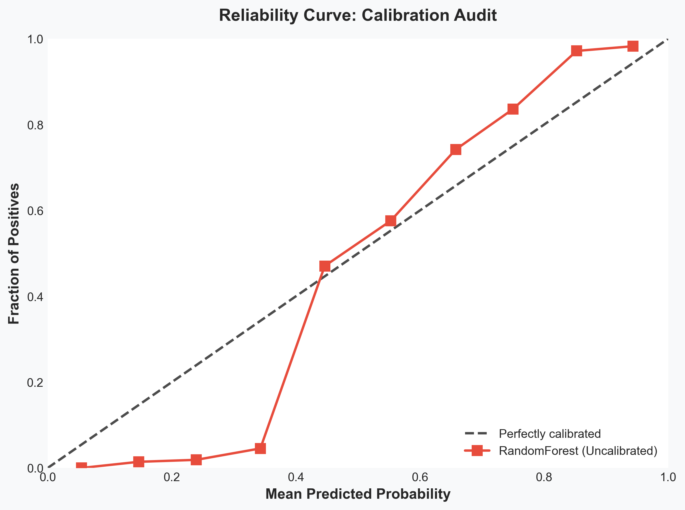
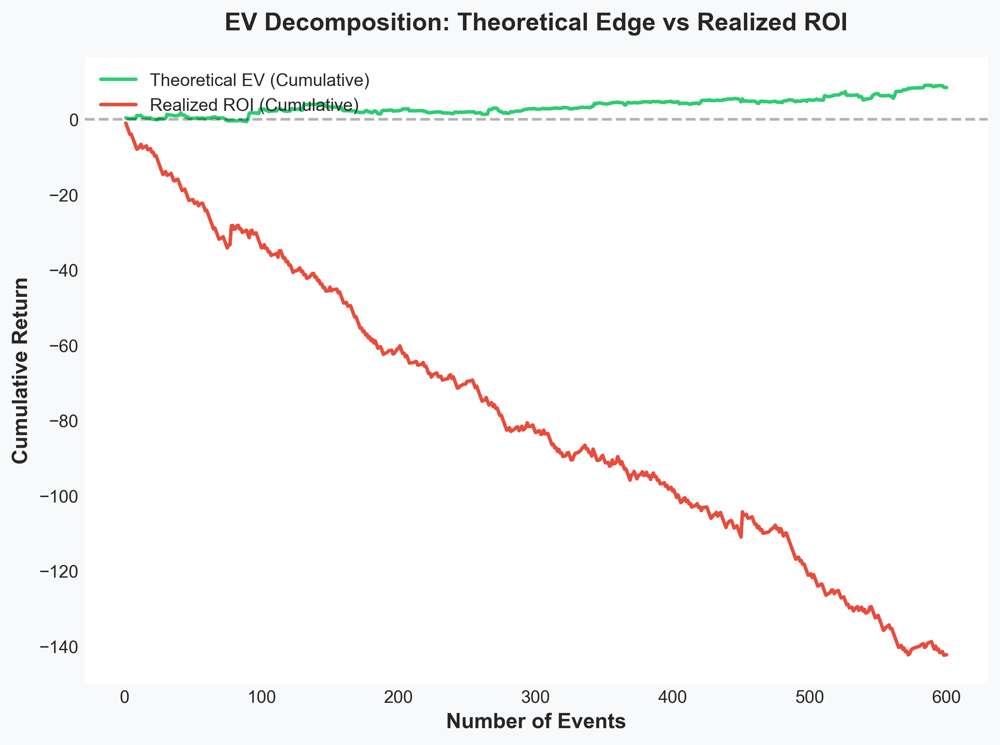
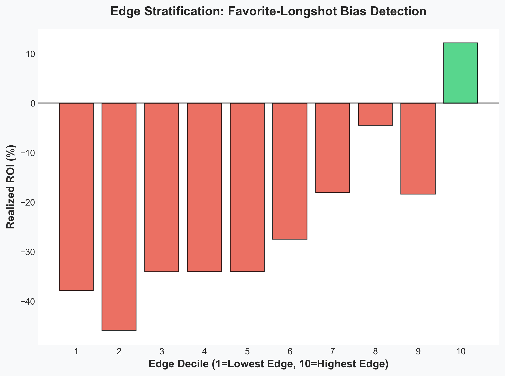
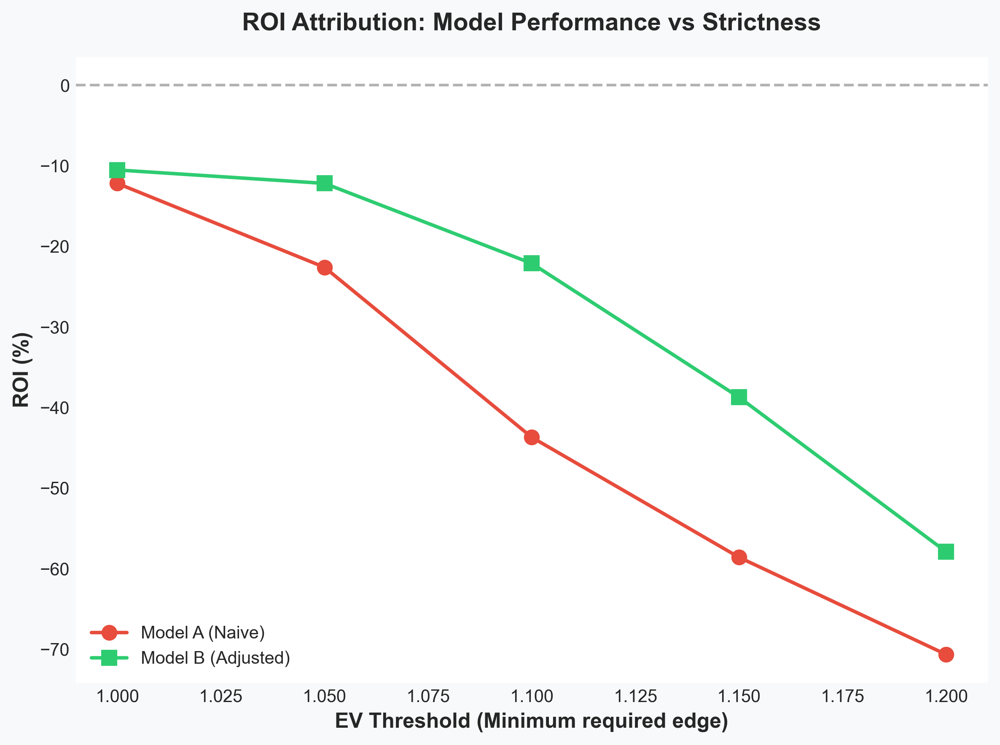

# QuantAudit

**A forensic Python library for auditing probabilistic models in asymmetric payoff environments.**

[](https://www.python.org/downloads/)
[](LICENSE)

---

## 🚨 The Problem: Why is my model losing money?

Your model has excellent Log Loss. Your calibration curves look perfect. But when you deploy it, it systematically destroys capital.

Standard libraries like `scikit-learn` tell you if your model is statistically accurate. **QuantAudit tells you why your model is financially failing.**

---

## 🧬 Genesis

QuantAudit was born from the autopsy of *VisionGoat*, a quantitative sports betting engine. Despite achieving excellent statistical calibration (Log Loss ~0.65), the project suffered systematic capital destruction (ROI -7% to -10%). The forensic analysis revealed that the model wasn't finding market inefficiencies; it was measuring its own cognitive biases.

QuantAudit is the open-source extraction of that forensic framework. It is not a tool to "find winning bets" or predict outcomes. It is a diagnostic scalpel to answer one question:

*"My model calculates positive Expected Value (EV), but my realized ROI is negative. Why?"*

---

## Why QuantAudit?

| Feature                             | scikit-learn | pyfolio / quantstats | **QuantAudit** |
| :---------------------------------- | :----------: | :------------------: | :------------: |
| Log Loss / Brier Score              |       ✅      |           ❌          |        ✅       |
| Expected Calibration Error (ECE)    |              |           ❌          |        ✅       |
| Overconfidence Index (OCI)          |       ❌      |           ❌          |        ✅       |
| Tail Error (Top X% Confidence)      |       ❌      |           ❌          |        ✅       |
| EV Realization & Bucket Mismatch    |       ❌      |           ❌          |        ✅       |
| Edge Stratification & FLB Detection |       ❌      |           ❌          |        ✅       |
| Multi-Model Threshold Backtesting   |  ❌ (Manual)  |           ❌          |   ✅ (Native)   |

---

## The 4-Step Autopsy Pipeline

QuantAudit structures the diagnostic process into four sequential modules.

### 1. `Calibration`

**Question:** *Is the model lying about its probabilities?*

Evaluates global and tail calibration to detect overconfidence in extreme predictions.

*Metrics: Log Loss, Brier Score, ECE, OCI, Tail Error.*



---

### 2. `Diagnostics: ev_decomposition`

**Question:** *Is the Expected Value formula broken?*

Decomposes Expected Value into realized outcomes to detect whether the model is finding genuine signal or merely measuring its own biases.



---

### 3. `Diagnostics: edge_stratification`

**Question:** *Is the theoretical edge translating into real money?*

Stratifies ROI by edge deciles and market implied probability. Detects Favorite-Longshot Bias (FLB) and Edge Inversion.



---

### 4. `Attribution:roi_attribution`

**Question:** *How do models perform under increasing strictness?*

Executes flat-stake backtests across multiple models and EV thresholds.

*Metrics: ROI, Profit Factor, Maximum Drawdown.*



## 🧪 Case Study: Diagnosing a Failed Model

The images above show the autopsy of a RandomForest classifier trained on synthetic data. 

**The illusion:** The model had positive theoretical EV (+8 cumulative) and acceptable calibration.

**The reality:** The model destroyed capital systematically (-142 cumulative ROI). 

**The diagnosis (via QuantAudit):**
1. The model was overconfident in high-probability predictions (Calibration Curve)
2. Only the top 10% of predictions were profitable (Edge Stratification)
3. Theoretical EV diverged massively from realized ROI (EV Decomposition)
4. No EV threshold made the model profitable (ROI Attribution)

**The lesson:** A model can look good on paper and still destroy capital. QuantAudit helps you find out why before you lose money.

---

## Installation

Clone the repository and install it in editable mode:

```bash
git clone https://github.com/Andres08232/quantaudit.git
cd quantaudit
pip install -e .
```

---

## ⚡ Quick Start

```python
import numpy as np
from quantaudit import (
    CalibrationAuditor,
    EVDecompositionAuditor,
    EdgeStratificationAuditor,
    ROIAttributionAuditor
)

# Generate synthetic data (or load your own)
np.random.seed(42)
n = 1000
y_true = np.random.binomial(1, 0.4, n)
market_price = 1.0 / np.random.uniform(0.3, 0.7, n)
model_probs = np.clip(y_true * 0.5 + np.random.normal(0.25, 0.2, n), 0.01, 0.99)

# 1. Calibration Audit
cal_audit = CalibrationAuditor(y_true, {"MyModel": model_probs})
print(cal_audit.summary())
cal_audit.plot_reliability_curves()

# 2. EV Decomposition
ev_audit = EVDecompositionAuditor(
    y_true,
    model_probs,
    market_price=market_price
)
print(ev_audit.summary())

# 3. Edge Stratification
edge_audit = EdgeStratificationAuditor(
    y_true,
    model_probs,
    market_price=market_price
)
print(edge_audit.summary())

# 4. ROI Attribution
roi_audit = ROIAttributionAuditor(
    y_true,
    models={
        "Model_A": model_probs,
        "Model_B": model_probs * 1.05
    },
    market_price=market_price,
    thresholds=[1.00, 1.05, 1.10]
)

roi_audit.plot_roi_vs_threshold()
```

---

## Testing

QuantAudit includes unit tests to ensure the mathematical integrity of the financial and probabilistic metrics.

```bash
pip install pytest
pytest tests/
```

---

## 🤝 Contributing & Connect

QuantAudit is built for builders, quants, and indie hackers who value rigorous validation over blind execution.

Found an issue or want a feature? Open a GitHub Issue.

Want to see how I apply this to real-world models? Connect with me on LinkedIn.

Need a forensic audit of your own ML model? Send me a DM.

